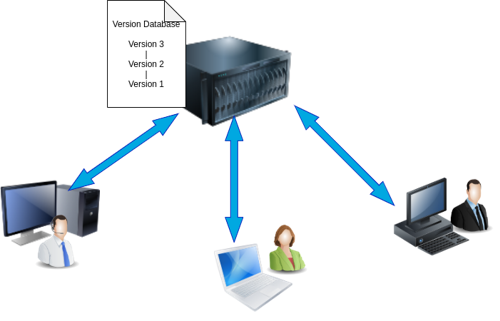
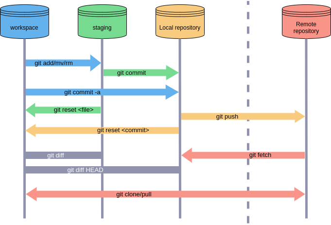
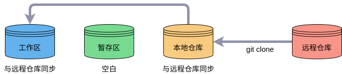
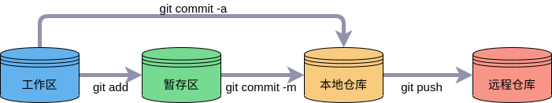
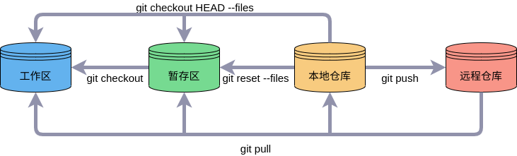
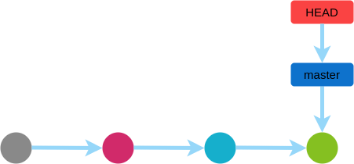
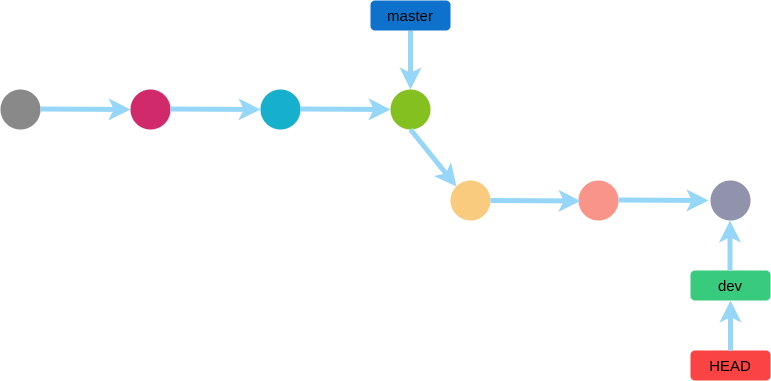
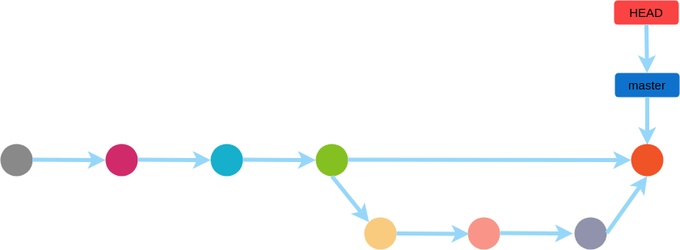
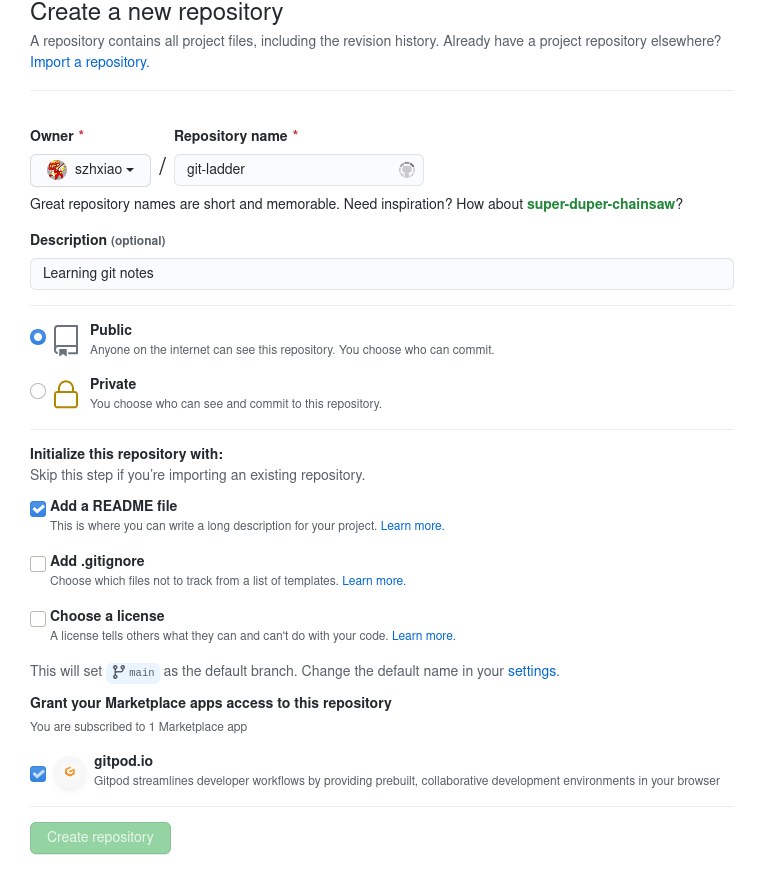

# git-ladder

## 1. 什么是 Git

git 是开源的分布式版本控制系统，由林纳斯·托瓦兹([Linus Benedict Torvalds](https://baike.baidu.com/item/%E6%9E%97%E7%BA%B3%E6%96%AF%C2%B7%E6%9C%AC%E7%BA%B3%E7%AC%AC%E5%85%8B%E7%89%B9%C2%B7%E6%89%98%E7%93%A6%E5%85%B9/1034429?fromtitle=Linus%20Torvalds&fromid=9336769))创作,最初用来管理 Linux 内核版本，现在广泛用于各类软件工程版本控制。

### 1.1 什么是版本控制系统

提供完备的版本管理功能，可记录目录和文件的修改，以便将来查看特定版本修订的情况。主要分为集中式版本控制系统和分布式版本控制系统。

#### 1.1.1 集中式版本控制系统

版本库存储于中央服务器，每次开发首先需要从中央服务器下载最新版本，工作结束后推送到中央服务器。

#### 1.1.2 分布式版本控制系统

分布式版本控制系统每个开发者本地都是一个完整的版本库，只需在完成开发后提交推送。

### 1.2 Git 能做什么

从[Git 官网](https://git-scm.com/)的介绍**everything-is-local**和 Git is a **free and open** source distributed `version control system` designed to **handle everything** from small to very large projects with **speed and efficiency**就可以知道 Git 的功能和特点。

#### 1.2.1 Git 功能

-   文件完整的修改记录

    对文件创建、内容修改及重命名等一系列操作，Git 可完整记录作者、日期、对比及修改意图等信息。

-   分布式版本控制

    开发者可以从服务器上克隆完整的仓库，在本地进行开发修改、创建与合并分支、提交等操作，且每次更改都可追塑。

#### 1.2.2 Git 特点

-   开源
-   分布式
-   高效
-   快速

## 2. 如何安装配置 Git

[Git](https://git-scm.com/)支持 Linux、Mac 及 Windows 各类平台。

### 2.1 Linux 平台安装

#### 2.1.1 Debian/Ubuntu

安装命令：

> sudo apt install git-all

安装后验证：

> git --version

#### 2.1.2 RedHat

安装命令：

> yum -y install git-all

安装后验证：

> git --version

#### 2.1.3 从源代码安装

> sudo dnf install dh-autoreconf curl-devel expat-devel gettext-devel \openssl-devel perl-devel zlib-devel

> sudo apt install dh-autoreconf libcurl4-gnutls-dev libexpat1-dev \gettext libz-dev libssl-dev

### 2.2 Windows 平台安装

下载[Windows 平台 Git](https://gitforwindows.org/)安装文件，或在[github](https://github.com)项目[git-for-windows](https://github.com/git-for-windows/git)内下载，根据提示进行安装。

安装完成后可在命令行使用 git，可以安装图形界面程序进行操作，如[GitHub Desktop](https://desktop.github.com/)、[GitKraken](https://www.gitkraken.com/)、[TortoiseGit](https://tortoisegit.org/)等等，非常好用。

### 2.3 Mac 平台安装

Mac 平台上可直接使用[图形化安装工具](https://sourceforge.net/projects/git-osx-installer)安装，安装后也可使用[GitHub Desktop](https://desktop.github.com/)、[GitKraken](https://www.gitkraken.com/)图形界面软件操作。

### 2.4 Git 配置

Git 提供了 git config 工具专门配置或读取相应的工作环境变量，这些环境变量决定 Git 在各个环节的具体工作方式和行为：

-   /etc/gitconfig: 系统中所有用户普遍适用的配置，使用 git config 时添加--system 选项，读写该文件。
-   ~/.gitconfig: 用户目录下的配置文件只适用于该用户，使用 git config 时添加--global 选项，读写该文件。
-   当前项目工作目录中.git/config: 配置仅对当前项目有效。

每个级别的配置都会覆盖上层的相同配置。

#### 2.4.1 用户信息

配置个人的用户名称和电子邮件地址：

> git config --global username "example"  
> git config --blobal user.email example@123.com

#### 2.4.2 文本编辑器

配置 Git 使用的默认文本编辑器：

> git config --global core.edit code/vim/emacs/gedit

#### 2.4.3 查看配置信息

> git config --list

## 3. Git 是怎样工作的

### 3.1 Git 工作简单样例

#### 3.1.1 创建版本库

1. 选择合适的目录，创建项目文件夹

    > mkdir git-ladder

2. 进入该项目文件夹，初始化仓库

    > cd git-ladder  
    > git init

    这时仓库为空，但当前目录下多了一个.git 目录，这个目录就是 Git 跟踪管理版本库的，默认隐藏。

3. 向仓库添加项目文件
   初始化仓库后即可在项目文件夹下进行创建、编辑、删除等操作。示例添加 README.md 文件，并加入内容：

    > git-ladder

    内容更改后将文件添加到仓库：

    > git add README.md

4. 提交更改到仓库

    > git commit -m "Add README.md"

    -m 后输入本次提交的说明，方便之后在历史记录中查找。

### 3.2 Git 工作原理

#### 3.2.1 远程仓库、工作区、暂存区、版本库

-   远程仓库

    远程服务器，一般为[github](https://github.com)、[gitlab](https://gitlab.com)或[gitee](https://gitee.com)等平台。

-   工作区

    本地电脑所看到的目录。

-   暂存区

    一般存放于.git 目录下的 index 文件中。

-   版本库

    隐藏目录.git 文件夹。

#### 3.2.2 Git 工作机制

## 4. Git 有哪些重要操作

### 4.1 图解基本操作

#### 4.1.1 创建仓库

> git init

#### 4.1.2 克隆项目

> git clone https://github.com/szhxiao/git-ladder

从服务器上克隆项目到本地，git clone 会生成一份副本，在本地仓库和工作区间同步，原理如图：

#### 4.1.3 提交代码

添加文件至暂存区：

> git add .

添加文件至本地仓库，并添加备注信息：

> git commit -m "commit information"

推送文件至远程仓库：

> git push

#### 4.1.4 代码回退

从远程仓库拉取代码至本地：

> git pull

用本地仓库覆盖暂存区中的修改：

> git reset --files

把文件从暂存区复制到工作区，放弃本地修改：

> git checkout --files

回退最后一次提交内容：

> git checkout HEAD --files

#### 4.1.5 版本回退

回退至上一个版本：

> git reset --hard HEAD^

回退至指定 ID：

> git reset --hard commit_ID

#### 4.1.6 删除文件

从版本库中删除文件：

> git rm fileName

### 4.2 图解分支操作

#### 4.2.1 分支管理

Git 把每次提交串成一条时间线，就是一个分支。开始时默认只有 master 一条分支，指向最新提交，再用 HEAD 指针 指向 master，以确定当前分支和当前提交点。每次提交时，当前分支都会向前移动一个新的版本。

如果再创建一个新分支 dev，Git 新建指针 dev，再把 HEAD 指向 dev，则表示当前提升指向新的分支，dev 分支会随着时间的推移形成许多新版本。

当分支 dev 完成开发后，提交至仓库，合并到 master 分支，删除 dev 分支，则完成了一次开发。Git 的合并是直接把 master 指向 dev 的当前提交，删除 dev 分支就是删除 dev 指针。

#### 4.2.2 创建分支

新建分支命令为：

> git branch \<branch-name\>

新建分支的实质就是新建一个引用，指向当前提交。

#### 4.2.3 查看分支

查看分支命令：

> git branch

分支前带`*`即表示为当前分支。

#### 4.2.4 切换分支

切换分支命令：

> git checkout \<branch-name\>

切换分支的实质，就是将 HEAD 由原来的引用指向新分支的引用上。

新建并切换分支命令：

> git checkout -b \<branch-name\>

命令`git checkout --<file>`为撤销操作，容易混淆，可以使用`switch`命令。

切换至已有分支命令：

> git switch \<branch-name\>

新建并切换到新分支：

> git switch -c \<branch-name\>

#### 4.2.5 合并分支

合并指定分支到当前分支命令：

> git merge \<branch-name>

例如，当前分支为 master，执行

> git merge dev

表示合并 dev 分支到当前 master 分支。

#### 4.2.6 删除分支

删除已有分支命令：

> git branch -d \<branch-name\>

强制删除命令：

> git branch -D \<branch-name\>

#### 4.2.7 冲突合并

当两条分支同时修改相同的文件并提交后，分支合并也失败，此时 Git 无法判断要保存哪个修改，出现冲突，必须手动解决。

### 4.3 远程仓库

#### 4.3.1 添加远程仓库

可以在 github 或 gitee 上创建仓库后通过`git pull`命令拉取至本地，也可以选择在本地创建 Git 仓库、在 github 创建仓库，并将两者远程同步。

本地与远程仓库同步主要操作：

1. 在 github 或 gitee 上新建仓库

    

    Repository name 填入所建仓库名，Description 输入仓库描述信息，创建一个 Git 仓库。

2. 关联本地仓库与远程仓库

    在本地仓库内运行命令：

    > git remote add origin git@github.com:username/git-repository-name.git

    **Tips**: 将`username`换成自己的用户名，将 `git-repository-name` 换成所建仓库的名字。

    添加后远程仓库的名字就是`origin`。

3. 推送本地仓库内容到远程

    把本地库的所有内容推送到远程库，执行命令：

    > git push -u origin master

    推送成功后，可以看到 github 页面与本地库内容相同。此后，本地仓库内容发生变化，可通过命令：

    > git push origin master

    将修改推送到 github。

#### 4.3.2 查看远程仓库

查看远程库信息：

> git remote -v

#### 4.3.3 删除远程仓库

根据名字删除：

> git remote rm origin

此处的删除是解除子本地和远程的绑定关系，并非删除远程仓库服务器上的内容，若要物理删除，须登录到 github 页面进行删除。

### 4.4 Git 日志

#### 4.4.1 查看历史提交记录

查看历史提交记录命令：

> git log

查看简洁历史记录：

> git log --online

#### 4.4.2 查看指定文件历史修改记录

查看指定文件修改记录：

> git blame \<file\>

### 4.5 Git 标签

标签也是版本库的一个快照，通常在某一时间某一版本打上标签。

#### 4.5.1 新建标签

新建标签命令：

> git tag \<tag-name\>

#### 4.5.2 查看标签

查看所有标签命令：

> git tag

查看某个特定标签：

> git show \<tag-name\>

#### 4.5.3 删除标签

删除标签命令：

> git tag -d \<tag-name\>

#### 4.5.4 推送标签至远程

推送指定标签命令：

> git push origin \<tag-name\>

推送所有标签命令：

> git push origin --tags

## 5. Git 命令常用表

| 类别     | 命令                            | 说明                     | 备注                    |
| :------- | :------------------------------ | :----------------------- | :---------------------- |
| 基础操作 | git init                        | 初始化仓库               |                         |
|          | git clone                       | 克隆项目                 | github, gitlab, gitee   |
|          | git add                         | 添加文件至暂存区         | `.`表示全部文件         |
|          | git commit                      | 添加文件至本地仓库       | -m 后添加提交信息       |
|          | git push                        | 文件推向远程仓库         |
|          | git pull                        | 拉取远程仓库代码         |
|          | git reset --files               | 用本地仓库覆盖暂存区     |
|          | git checkout --files            | 复制暂存区文件至工作区   | HEAD 表示当前版本       |
|          | git rm                          | 删除工作区文件           |
|          | git mv                          | 移动或重命名工作区文件   |
|          | git diff                        | 比较暂存区与工作区的差异 |
|          | git status                      | 查看仓库的状态           |
| 分支操作 | git branch                      | 查看分支                 |
|          | git branch \<branch-name\>      | 创建分支                 |
|          | git checkout \<branch-name\>    | 切换分支                 |
|          | git switch \<branch-name\>      | 切换分支                 |
|          | git checkout -b \<branch-name\> | 创建并切换分支           |
|          | git switch -c \<branch-name\>   | 创建并切换分支           |
|          | git merge \<branch-name\>       | 合并指定分支到当前分支   |
|          | git branch -d \<branch-name\>   | 删除分支                 | -D 为强制删除           |
| 远程操作 | git remote add origin           | 关联本地与远程仓库       |
|          | git remote -v                   | 查看远程仓库信息         |
|          | git remote rm origin            | 删除远程仓库             |
| 日志操作 | git log                         | 查看历史提交记录         | --online 参数为简洁记录 |
|          | git blame                       | 查看指定文件修改记录     |
| 标签操作 | git tag \<tag-name\>            | 新建标签                 |
|          | git tag                         | 查看所有标签             |
|          | git show \<tag-name\>           | 查看某个特定标签         |
|          | git tag -d \<tag-name\>         | 删除标签                 |
|          | git push origin \<tag-name\>    | 推送指定标签             |
|          | git push origin --tags          | 推送所有标签             |                         |
